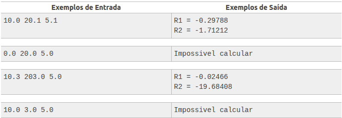
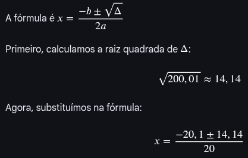
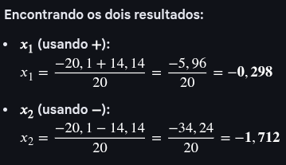

# Fórmula de Bhaskara
###### beecrowd | 1036

Leia 3 valores de ponto flutuante e efetue o cálculo das raízes da equação de Bhaskara.
Se não for possível calcular as raízes, mostre a mensagem correspondente “Impossivel calcular”,
caso haja uma divisão por 0 ou raiz de número negativo.

Entrada
Leia três valores de ponto flutuante (double) A, B e C.

Saída
Se não houver possibilidade de calcular as raízes, apresente a mensagem "Impossivel calcular". Caso contrário,
imprima o resultado das raízes com 5 dígitos após o ponto, com uma mensagem correspondente conforme exemplo abaixo.
Imprima sempre o final de linha após cada mensagem.

### 1. Cálculo do Delta Δ

##### A fórmula é Δ = b²-4ac

###### . b²= (20,1)² = 404,01

###### . 4ac= 4 * 10 * 5,1 = 204

##### Δ = 404,01-204
##### Δ = 200,01

### 2. Cálculo das Raízes

##### Resumo do resultado:

Para os valores a=10, b=20,1 e c=5,1:

Delta (Δ):200,01

Raiz 1 (x¹): -0,298

Raiz 2 (x²): -1,712